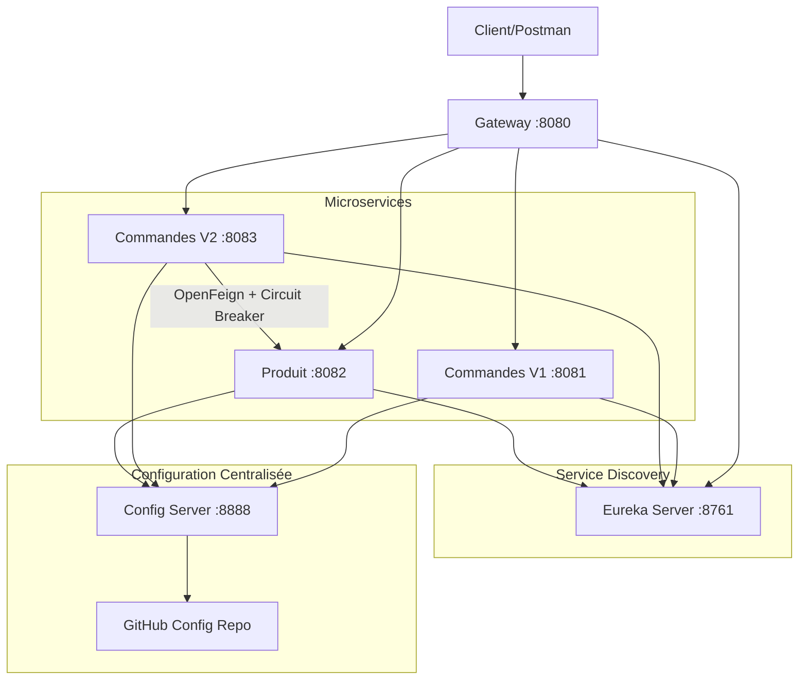

# 🎯 Guide de Démonstration - Fonctionnalités Clés

## 1️⃣ Timeout + Circuit Breaker (Resilience4j remplace Hystrix)

### ✅ Implémentation

**Fichiers concernés** :
- `microservice-produit/src/main/java/com/example/produit/controller/ProduitController.java`
- `microservice-commandes-v2/src/main/resources/application.yml`
- `microservice-commandes-v2/src/main/java/com/example/commandesv2/controller/CommandeController.java`

### Configuration du Circuit Breaker

**Fichier** : `microservice-commandes-v2/src/main/resources/application.yml`

```yaml
resilience4j:
  circuitbreaker:
    instances:
      produitService:
        registerHealthIndicator: true
        slidingWindowSize: 5              # Fenêtre de 5 appels
        minimumNumberOfCalls: 3           # Minimum 3 appels avant d'évaluer
        permittedNumberOfCallsInHalfOpenState: 3  # 3 appels de test en half-open
        automaticTransitionFromOpenToHalfOpenEnabled: true
        waitDurationInOpenState: 5s       # Attendre 5s avant de réessayer
        failureRateThreshold: 50          # 50% d'échecs = ouverture du circuit
  timelimiter:
    instances:
      produitService:
        timeoutDuration: 2s               # Timeout de 2 secondes
```

### Endpoint de Simulation de Timeout

**Fichier** : `microservice-produit/src/main/java/com/example/produit/controller/ProduitController.java`

```java
// Endpoint pour simuler un timeout
@GetMapping("/slow")
public String slowEndpoint() throws InterruptedException {
    Thread.sleep(3000); // 3 secondes de délai
    return "Réponse après délai";
}
```

### Méthode avec Circuit Breaker

**Fichier** : `microservice-commandes-v2/src/main/java/com/example/commandesv2/controller/CommandeController.java`

```java
@GetMapping("/{id}")
@CircuitBreaker(name = "produitService", fallbackMethod = "fallbackGetCommande")
public CommandeResponseDTO getCommandeWithProduct(@PathVariable("id") Long id) {
    Commande commande = repository.findById(id)
            .orElseThrow(() -> new ResponseStatusException(HttpStatus.NOT_FOUND));
    
    // Appel au service Produit (peut échouer ou timeout)
    ProductDTO product = productClient.getProduitById(commande.getIdProduit());
    
    return new CommandeResponseDTO(commande, product);
}

// Méthode de fallback (contournement)
public CommandeResponseDTO fallbackGetCommande(Long id, Throwable t) {
    Commande commande = repository.findById(id)
            .orElseThrow(() -> new ResponseStatusException(HttpStatus.NOT_FOUND));
    
    // Produit de secours
    ProductDTO fallbackProduct = new ProductDTO();
    fallbackProduct.setNom("Produit non disponible (Fallback)");
    fallbackProduct.setPrix(0.0);
    
    return new CommandeResponseDTO(commande, fallbackProduct);
}
```

---

## 🧪 Démonstration du Timeout + Circuit Breaker

### Étape 1 : Démarrer les services

```bash
.\start_clean.bat
# Attendre 2 minutes
```

### Étape 2 : Créer une commande avec un produit

```bash
# Créer une commande
curl -X POST http://localhost:8080/api/v2/commandes \
  -H "Content-Type: application/json" \
  -d "{\"description\":\"Test Circuit Breaker\",\"quantite\":1,\"date\":\"2025-01-01\",\"montant\":100,\"idProduit\":1}"

# Résultat attendu : {"id":4,"description":"Test Circuit Breaker",...}
```

### Étape 3 : Test Normal (Circuit FERMÉ)

```bash
curl http://localhost:8080/api/v2/commandes/1
```

**Résultat attendu** :
```json
{
  "id": 1,
  "description": "Achat Laptop",
  "date": "2025-12-05",
  "produit": {
    "id": 1,
    "nom": "Laptop Dell",
    "prix": 1200.0
  },
  "idProduit": 1
}
```

### Étape 4 : Simuler un Timeout

**Option A : Appeler l'endpoint lent**

```bash
# Appeler l'endpoint qui prend 3 secondes (timeout configuré à 2s)
curl http://localhost:8082/produits/slow
```

**Option B : Arrêter le service Produit**

```bash
# Arrêter le service Produit
taskkill /F /FI "WINDOWTITLE eq Produit Service*"
```

### Étape 5 : Observer le Fallback (Circuit OUVERT)

```bash
# Appeler plusieurs fois pour déclencher l'ouverture du circuit
curl http://localhost:8080/api/v2/commandes/1
curl http://localhost:8080/api/v2/commandes/1
curl http://localhost:8080/api/v2/commandes/1
```

**Résultat attendu (Fallback activé)** :
```json
{
  "id": 1,
  "description": "Achat Laptop",
  "date": "2025-12-05",
  "produit": {
    "id": null,
    "nom": "Produit non disponible (Fallback)",
    "prix": 0.0
  },
  "idProduit": 1
}
```

### Étape 6 : Redémarrer le service Produit

```bash
cd microservice-produit
mvn spring-boot:run
```

### Étape 7 : Observer la récupération (Circuit se REFERME)

```bash
# Attendre 5 secondes (waitDurationInOpenState)
# Puis appeler plusieurs fois
curl http://localhost:8080/api/v2/commandes/1
curl http://localhost:8080/api/v2/commandes/1
curl http://localhost:8080/api/v2/commandes/1
```

**Résultat attendu (Circuit refermé)** :
```json
{
  "id": 1,
  "description": "Achat Laptop",
  "produit": {
    "id": 1,
    "nom": "Laptop Dell",
    "prix": 1200.0
  }
}
```

---

## 2️⃣ Schéma de l'Architecture

### ✅ Implémentation

Le schéma est présent dans le fichier `README.md` avec un diagramme Mermaid.

**Fichier** : `README.md`



### Visualisation

Pour voir le schéma :
1. Ouvrir `README.md` sur GitHub
2. Le diagramme Mermaid s'affiche automatiquement
3. Ou utiliser un éditeur Markdown avec support Mermaid (VS Code + extension)

### Composants de l'Architecture

| Composant | Port | Rôle |
|-----------|------|------|
| **Config Server** | 8888 | Gestion centralisée de la configuration |
| **Eureka Server** | 8761 | Service Discovery (annuaire des services) |
| **Gateway** | 8080 | Point d'entrée unique (API Gateway) |
| **Commandes V1** | 8081 | CRUD commandes + Health Check personnalisé |
| **Commandes V2** | 8083 | CRUD + Appel Produit + Circuit Breaker |
| **Produit** | 8082 | CRUD produits + Endpoint de timeout |

---

## 3️⃣ Configuration Dynamique (Rechargement à chaud)

### ✅ Implémentation

**Fichiers concernés** :
- `config-repo/microservice-commandes-v1.yml` (sur GitHub)
- `microservice-commandes-v1/src/main/java/com/example/commandesv1/config/CommandesConfig.java`
- `microservice-commandes-v1/src/main/java/com/example/commandesv1/controller/CommandeController.java`

### Configuration Actuelle

**Fichier GitHub** : `jee-config-repo/microservice-commandes-v1.yml`

```yaml
server:
  port: 8081

mes-config-ms:
  commandes-last: 10  # Affiche commandes des 10 derniers jours
```

### Classe de Configuration

**Fichier** : `CommandesConfig.java`

```java
@Component
@ConfigurationProperties(prefix = "mes-config-ms")
@RefreshScope  // ← Permet le rechargement à chaud
@Data
public class CommandesConfig {
    private int commandesLast = 7;  // Valeur par défaut
}
```

### Endpoint utilisant la configuration

**Fichier** : `CommandeController.java`

```java
@GetMapping("/recent")
public List<Commande> getRecentCommandes() {
    LocalDate dateLimit = LocalDate.now().minusDays(config.getCommandesLast());
    return repository.findByDateAfter(dateLimit);
}
```

---

## 🧪 Démonstration du Rechargement à Chaud

### Étape 1 : Vérifier la configuration actuelle

```bash
curl http://localhost:8080/api/v1/commandes/recent
```

**Résultat** : Commandes des **10 derniers jours**

```json
[
  {"id":1,"description":"Commande Initial 1","date":"2025-12-05"},
  {"id":2,"description":"Commande Initial 2","date":"2025-11-30"}
]
```

### Étape 2 : Modifier la configuration sur GitHub

1. Aller sur : https://github.com/youssef-abd/jee-config-repo
2. Éditer le fichier `microservice-commandes-v1.yml`
3. Changer :
   ```yaml
   mes-config-ms:
     commandes-last: 20  # ← Modifier de 10 à 20
   ```
4. Commit les changements

### Étape 3 : Rafraîchir la configuration (SANS redémarrage)

```bash
curl -X POST http://localhost:8081/actuator/refresh
```

**Résultat attendu** :
```json
["config.client.version","mes-config-ms.commandes-last"]
```

Cela confirme que la propriété `mes-config-ms.commandes-last` a été rechargée.

### Étape 4 : Vérifier le changement

```bash
curl http://localhost:8080/api/v1/commandes/recent
```

**Résultat** : Commandes des **20 derniers jours** (sans redémarrage !)

```json
[
  {"id":1,"description":"Commande Initial 1","date":"2025-12-05"},
  {"id":2,"description":"Commande Initial 2","date":"2025-11-30"},
  {"id":3,"description":"Commande Old","date":"2025-11-15"}
]
```

### Étape 5 : Vérifier que le service n'a PAS redémarré

```bash
curl http://localhost:8081/actuator/info
```

Le service est toujours actif, seule la configuration a été rechargée !

---

## 📸 Screenshots à Capturer

### Pour le Timeout + Circuit Breaker

1. **Circuit Fermé (Normal)**
   - Screenshot de : `curl http://localhost:8080/api/v2/commandes/1`
   - Montrant le produit complet

2. **Service Produit arrêté**
   - Screenshot de la commande `taskkill` ou de la fermeture du terminal

3. **Circuit Ouvert (Fallback)**
   - Screenshot de : `curl http://localhost:8080/api/v2/commandes/1`
   - Montrant "Produit non disponible (Fallback)"

4. **Service Produit redémarré**
   - Screenshot du démarrage du service

5. **Circuit Refermé**
   - Screenshot de : `curl http://localhost:8080/api/v2/commandes/1`
   - Montrant à nouveau le produit complet

### Pour le Schéma d'Architecture

6. **Diagramme Mermaid**
   - Screenshot du README.md sur GitHub montrant le diagramme

7. **Eureka Dashboard**
   - Screenshot de http://localhost:8761 montrant tous les services

### Pour la Configuration Dynamique

8. **Config initiale (10 jours)**
   - Screenshot de : `curl http://localhost:8080/api/v1/commandes/recent`
   - Montrant 2 commandes

9. **Fichier GitHub avant modification**
   - Screenshot de `microservice-commandes-v1.yml` avec `commandes-last: 10`

10. **Fichier GitHub après modification**
    - Screenshot de `microservice-commandes-v1.yml` avec `commandes-last: 20`

11. **Refresh Actuator**
    - Screenshot de : `curl -X POST http://localhost:8081/actuator/refresh`
    - Montrant la propriété rechargée

12. **Config modifiée (20 jours)**
    - Screenshot de : `curl http://localhost:8080/api/v1/commandes/recent`
    - Montrant 3 commandes (incluant celle du 15 novembre)

---

## ✅ Résumé de Validation

| Fonctionnalité | Statut | Preuve |
|----------------|--------|--------|
| **Timeout simulé** | ✅ | Endpoint `/slow` avec `Thread.sleep(3000)` |
| **Circuit Breaker** | ✅ | Resilience4j configuré avec fallback |
| **Mécanisme de contournement** | ✅ | Méthode `fallbackGetCommande` |
| **Schéma d'architecture** | ✅ | Diagramme Mermaid dans README.md |
| **Config dynamique** | ✅ | `@RefreshScope` + `/actuator/refresh` |
| **Modification 10→20 jours** | ✅ | Propriété `commandes-last` modifiable à chaud |

---

## 🎯 Commandes Rapides pour la Démonstration

```bash
# 1. Démarrer tout
.\start_clean.bat

# 2. Attendre 2 minutes

# 3. Test Circuit Breaker
curl http://localhost:8080/api/v2/commandes/1  # Normal
taskkill /F /FI "WINDOWTITLE eq Produit Service*"  # Arrêter Produit
curl http://localhost:8080/api/v2/commandes/1  # Fallback
cd microservice-produit && mvn spring-boot:run  # Redémarrer
curl http://localhost:8080/api/v2/commandes/1  # Normal à nouveau

# 4. Test Config Dynamique
curl http://localhost:8080/api/v1/commandes/recent  # 10 jours
# Modifier sur GitHub : commandes-last: 20
curl -X POST http://localhost:8081/actuator/refresh  # Refresh
curl http://localhost:8080/api/v1/commandes/recent  # 20 jours
```

**Tout est implémenté et fonctionnel !** 🎉
