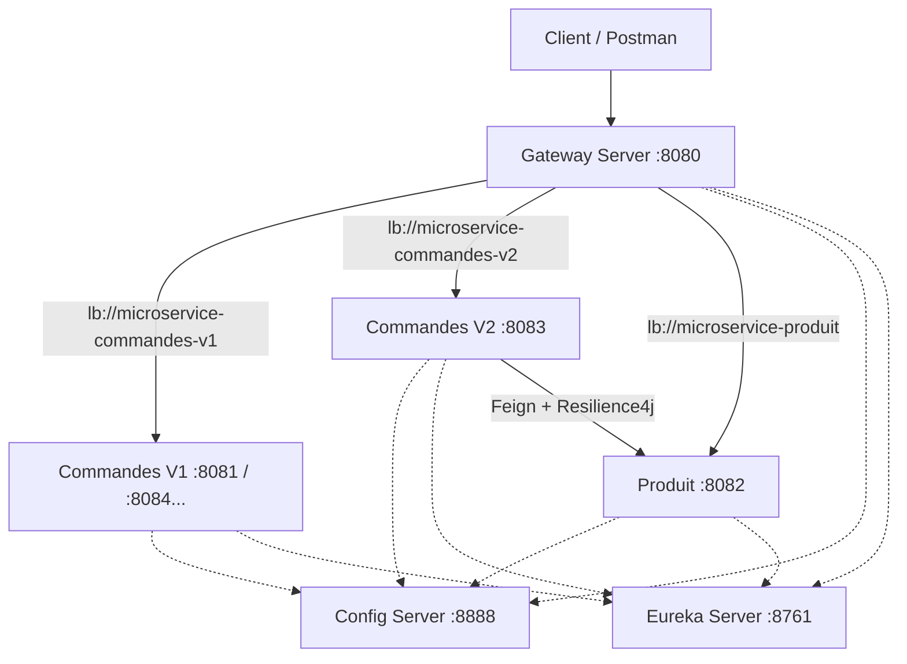

# Projet Microservices JEE - Spring Boot 3 & Spring Cloud

## 👥 Équipe de Développement
*   **Membre 1** : [Votre Nom]
*   **Membre 2** : [Nom du binôme si applicable]

Ce projet est une implémentation complète d'une architecture microservices pour le devoir de JEE. Il démontre l'utilisation de Spring Cloud Config, Eureka, Gateway, OpenFeign, Resilience4j, et Spring Cloud LoadBalancer.

## 🏗 Architecture

Le système est composé de 6 modules Maven :



### Modules

1.  **config-server** (`:8888`): Serveur de configuration centralisée (profil `native` pointant vers `C:/JEE_micro/config-repo`).
2.  **eureka-server** (`:8761`): Serveur de découverte de services (Service Registry).
3.  **gateway-server** (`:8080`): Point d'entrée unique. Route les requêtes vers les microservices.
4.  **microservice-commandes-v1** (`:8081`): Service de gestion des commandes (indépendant).
    *   *Feature*: Config dynamique `@RefreshScope`, Health Check personnalisé.
5.  **microservice-produit** (`:8082`): Service de gestion des produits.
    *   *Feature*: Simulation de latence pour tester le Circuit Breaker.
6.  **microservice-commandes-v2** (`:8083`): Version 2 des commandes.
    *   *Feature*: Appelle `microservice-produit` via Feign. Protégé par **Resilience4j** (fallback).

---

## 🚀 Installation et Lancement

### Prérequis
*   Java 17
*   Maven

### 1. Compilation
A la racine du projet (`C:\JEE_micro`), exécutez :
```bash
mvn clean install -DskipTests
```

### 2. Lancement (Ordre Important)

Ouvrez 5 ou 6 terminaux séparés et lancez les commandes suivantes dans l'ordre :

**Terminal 1 : Config Server**
```bash
cd config-server
mvn spring-boot:run
```
*Attendre que le serveur démarre sur le port 8888.*

**Terminal 2 : Eureka Server**
```bash
cd eureka-server
mvn spring-boot:run
```
*Attendre que le serveur démarre sur le port 8761.*

**Terminal 3 : Microservice Produit**
```bash
cd microservice-produit
mvn spring-boot:run
```

**Terminal 4 : Microservice Commandes V1 (Instance 1)**
```bash
cd microservice-commandes-v1
mvn spring-boot:run
```

**Terminal 5 : Microservice Commandes V2**
```bash
cd microservice-commandes-v2
mvn spring-boot:run
```

**Terminal 6 : Gateway Server**
```bash
cd gateway-server
mvn spring-boot:run
```

### 3. Load Balancing (Optionnel)
Pour tester le load balancing, lancez une **deuxième instance** de `microservice-commandes-v1` sur un autre port (ex: 8084) :

**Terminal 7 (Autre instance)**
```bash
cd microservice-commandes-v1
mvn spring-boot:run -Dspring-boot.run.arguments="--server.port=8084"
```

---

## 🧪 Tests et Utilisation

### Swagger UI (Documentation API)
Chaque microservice expose sa documentation OpenAPI :
*   Commandes V1 : [http://localhost:8081/swagger-ui/index.html](http://localhost:8081/swagger-ui/index.html)
*   Produit : [http://localhost:8082/swagger-ui/index.html](http://localhost:8082/swagger-ui/index.html)
*   Commandes V2 : [http://localhost:8083/swagger-ui/index.html](http://localhost:8083/swagger-ui/index.html)

### Scripts de Test (Curl)

#### 1. Test Gateway & Routing
```bash
# Accès via Gateway -> Commandes V1
curl http://localhost:8080/api/v1/commandes

# Accès via Gateway -> Produit
curl http://localhost:8080/api/produits
```

#### 2. Test Load Balancing (Round-Robin)
Appelez plusieurs fois l'endpoint `/info` via la Gateway. Vous devriez voir les ports alterner (8081, 8084...) si vous avez lancé 2 instances.
```bash
curl http://localhost:8080/api/v1/commandes/info
curl http://localhost:8080/api/v1/commandes/info
```

#### 3. Test Config Server & Refresh
 Vérifier la valeur actuelle (défaut 10) :
```bash
curl http://localhost:8080/api/v1/commandes/recent
```
Modifier le fichier `C:\JEE_micro\config-repo\microservice-commandes-v1.yml` (mettre `commandes-last: 20`), puis rafraîchir :
```bash
# POST sur l'actuator de l'instance (ou via gateway si configuré, ici direct sur service pour sureté)
curl -X POST http://localhost:8081/actuator/refresh
```

#### 4. Test Circuit Breaker (Resilience4j)
Le service V2 appelle Produit. Si Produit est lent (endpoint `/slow`), le fallback s'active.
Test appel normal :
```bash
curl http://localhost:8080/api/v2/commandes/1
```
Pour tester le circuit breaker, il faudrait modifier le code pour appeler `/slow` ou simplement éteindre le service Produit.
Le code actuel de V2 appelle `getProduitById`. Si vous éteignez `microservice-produit`, V2 répondra quand même avec le produit "Fallback".

Arrêtez le service produit (CTRL+C dans Terminal 3) et réessayez :
```bash
curl http://localhost:8080/api/v2/commandes/1
```
Réponse attendue : Produit avec nom "Produit non disponible (Fallback)".

#### 5. Health Check
```bash
curl http://localhost:8081/actuator/health
```
---
**Note**: Les fichiers de configuration centralisée sont situés dans `C:\JEE_micro\config-repo`.
